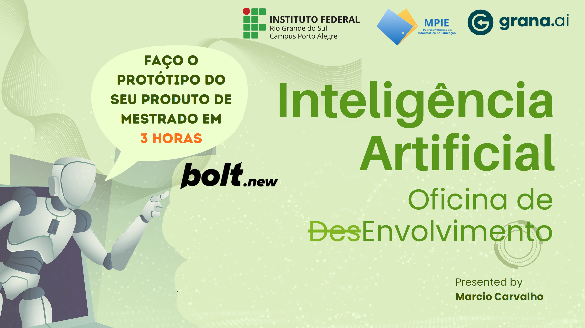

# 🎓 Oficina de ~~Des~~Envolvimento com IA - MPIE IFRS



## 🚀 Sobre a Oficina

Esta oficina demonstra o poder da **Inteligência Artificial como ferramenta de desenvolvimento**, mostrando como criar protótipos funcionais em tempo recorde. Durante a apresentação, exploramos conceitos fundamentais de IA, técnicas de prompting eficazes e ferramentas modernas que aceleram o desenvolvimento de software.

### 🎯 **Objetivo Principal**
Capacitar profissionais da área da saúde e educação a utilizarem IA para criar soluções tecnológicas, mesmo sem conhecimento avançado em programação.

### 🛠️ **Ferramentas Demonstradas**
- **[Bolt.new](https://bolt.new)** - Desenvolvimento web visual com IA
- **[Cursor](https://cursor.com)** - Editor de código com IA integrada
- **Técnicas de Prompting** - 6 tipos essenciais para resultados eficazes

### 📚 **Conceitos Abordados**
- **Prompts vs Agentes**: Diferença entre comandos simples e sistemas autônomos
- **Tipos de Prompts**: Direto, Persona, Formato, Contexto, Iterativo e Multitarefa
- **Prototipagem Rápida**: Do conceito ao produto funcional em horas

---

## 📊 Projeto Demonstrativo: Pesquisa de Impacto dos Emojis

Uma plataforma interativa de pesquisa desenvolvida **durante a oficina** para demonstrar o potencial da IA no desenvolvimento de aplicações completas e funcionais.

**🌐 Site em produção:** [https://regal-manatee-89073b.netlify.app](https://regal-manatee-89073b.netlify.app)

### ✨ Funcionalidades Implementadas

#### 📝 Wizard de Pesquisa Inteligente
- Interface step-by-step com barra de progresso visual
- Avanço automático ao selecionar respostas
- Validação em tempo real dos campos obrigatórios
- Salvamento automático de rascunhos no localStorage
- Design responsivo otimizado para desktop e mobile

#### 📈 Dashboard Analítico Avançado
- Visualizações interativas usando Chart.js
- Métricas em tempo real com cards informativos
- Múltiplos tipos de gráficos (barras, pizza, linha, faixa etária)
- Exportação de dados em formato CSV
- Compartilhamento de resultados via link ou email

#### 🎨 Design System Profissional
- Paleta Ferrari (vermelho, amarelo, preto)
- Componentes modulares e reutilizáveis
- Animações fluidas e micro-interações
- Sistema de espaçamento consistente (8px grid)

---

## 🛠️ Stack Tecnológica

### Frontend
- **React 18** - Biblioteca principal
- **TypeScript** - Tipagem estática
- **Tailwind CSS** - Framework de estilização
- **Vite** - Build tool e dev server

### Visualização de Dados
- **Chart.js** - Biblioteca de gráficos
- **react-chartjs-2** - Wrapper React para Chart.js

### Ícones e UI
- **Lucide React** - Biblioteca de ícones
- **date-fns** - Manipulação de datas

### Armazenamento
- **localStorage** - Persistência local dos dados
- **JSON** - Formato de armazenamento

---

## 🚀 Como Executar

### Pré-requisitos
- Node.js 18+ 
- npm ou yarn

### Instalação
```bash
# Clone o repositório
git clone https://github.com/marciocar/mpieifrsw.git

# Entre no diretório
cd mpieifrsw

# Instale as dependências
npm install

# Execute em modo desenvolvimento
npm run dev
```

### Build para Produção
```bash
# Gerar build otimizado
npm run build

# Preview do build
npm run preview
```

---

## 📋 Estrutura do Projeto

```
src/
├── components/           # Componentes React
│   ├── Dashboard.tsx    # Painel principal com gráficos
│   ├── SurveyWizard.tsx # Wizard da pesquisa
│   ├── QuestionCard.tsx # Card individual de pergunta
│   ├── ProgressBar.tsx  # Barra de progresso
│   ├── WizardNavigation.tsx # Navegação do wizard
│   ├── SharedView.tsx   # Visualização compartilhada
│   ├── ShareModal.tsx   # Modal de compartilhamento
│   └── Toast.tsx        # Notificações
├── types/               # Definições TypeScript
│   └── survey.ts       # Tipos da pesquisa
├── utils/              # Utilitários
│   ├── storage.ts      # Gerenciamento localStorage
│   ├── analytics.ts    # Processamento de dados
│   └── shareUtils.ts   # Utilitários de compartilhamento
├── hooks/              # Custom Hooks
│   └── useToast.ts     # Hook para notificações
├── App.tsx             # Componente raiz
└── main.tsx           # Entry point
```

---

## 📊 Casos de Uso Educacionais

### Para Pesquisadores em Educação
- Coleta estruturada de dados sobre comunicação digital
- Análise estatística em tempo real
- Exportação para ferramentas de análise avançada (Excel, SPSS, R)

### Para Profissionais de Tecnologia Educacional
- Insights sobre percepção de emojis em interfaces educacionais
- Dados demográficos para personas de estudantes
- Tendências de uso por faixa etária

### Para Linguistas Digitais
- Padrões de uso de emojis em contextos educacionais
- Impacto na interpretação textual
- Evolução temporal do uso

---

## 🎓 Sobre o MPIE

### 🏛️ **MPIE - Mestrado Profissional em Informática na Educação - IFRS**

O Mestrado Profissional em Informática na Educação tem por objetivo geral qualificar profissionais para atuarem no campo interdisciplinar das tecnologias de informação e comunicação aplicadas à educação, a partir da imersão na pesquisa.

🌐 **Site oficial:** [https://mpie.poa.ifrs.edu.br/](https://mpie.poa.ifrs.edu.br/)

### 🌟 **Por que o MPIE é Especial:**
- 🎯 **Foco na Prática**: Cada projeto tem aplicação real no mundo educacional
- 👥 **Corpo Docente Excepcional**: Professores que são referência nacional e internacional
- 🚀 **Inovação Constante**: Sempre na vanguarda das tecnologias educacionais
- 🤝 **Comunidade Acolhedora**: Ambiente colaborativo e inspirador
- 📚 **Pesquisa Aplicada**: Conhecimento que transforma realidades

### 🏛️ **Instituto Federal do Rio Grande do Sul - Campus Porto Alegre**

**Instituto Federal de Educação, Ciência e Tecnologia do Rio Grande do Sul – Campus Porto Alegre**

📍 **Endereço:** Rua Cel. Vicente, 281 | Bairro Centro Histórico | CEP: 90.030-041 | Porto Alegre/RS

📧 **E-mail:** comunicacao@poa.ifrs.edu.br

📞 **Telefone:** (51) 3930-6002

🌐 **Site:** [https://poa.ifrs.edu.br/](https://poa.ifrs.edu.br/)

---

## 🙏 Agradecimentos Especiais

Esta oficina foi possível graças ao convite dos **professores excepcionais** do MPIE-IFRS:

### 👩‍🏫 **Profa. Dra. Silvia de Castro Bertagnolli**
### 👨‍🏫 **Prof. Dr. Fabio Yoshimitsu Okuyama** 
### 👨‍🏫 **Prof. Dr. Marcelo Augusto Rauh Schmitt**

---

## 🎮 QUEST: Crie Seu Produto do Conhecimento!

### 🏆 **MISSÃO PRINCIPAL: De Mestrando a Criador de Soluções**

Caro(a) mestrando(a), você está prestes a embarcar na **quest mais importante** da sua jornada acadêmica: **transformar seu conhecimento em um produto que impacte a educação!**

### 🎯 **OBJETIVOS DA QUEST:**

#### 🥉 **NÍVEL BRONZE - Ideação**
- [ ] **Identificar o Problema**: Qual dor educacional você quer resolver?
- [ ] **Definir o Público**: Quem são seus "usuários finais"?
- [ ] **Mapear Recursos**: Que tecnologias você dominará?
- [ ] **Criar Personas**: Quem se beneficiará da sua solução?

**🎁 RECOMPENSA:** Clareza sobre seu propósito e direção!

#### 🥈 **NÍVEL PRATA - Prototipagem**
- [ ] **MVP Funcional**: Primeira versão que resolve o problema core
- [ ] **Testes com Usuários**: Feedback real de educadores/estudantes
- [ ] **Iterações Rápidas**: Melhorias baseadas em dados
- [ ] **Documentação**: README que inspira outros a usar

**🎁 RECOMPENSA:** Produto testado e validado por usuários reais!

#### 🥇 **NÍVEL OURO - Impacto**
- [ ] **Implementação Real**: Uso efetivo em ambiente educacional
- [ ] **Métricas de Sucesso**: Dados que comprovam o impacto
- [ ] **Escalabilidade**: Potencial para crescer e atingir mais pessoas
- [ ] **Sustentabilidade**: Modelo que garante continuidade

**🎁 RECOMPENSA:** Transformação real na educação + Mestrado concluído!

### 🚀 **POWER-UPS DISPONÍVEIS:**

#### 🤖 **IA Assistant** 
- **Bolt.new**: Para desenvolvimento web rápido
- **Cursor**: Para programação assistida
- **ChatGPT/Claude**: Para ideação e documentação
- **GitHub Copilot**: Para acelerar o código

#### 📚 **Knowledge Base**
- **Orientador**: Seu mentor principal (XP em dobro!)
- **Colegas de Turma**: Sua guild de apoio
- **Professores**: NPCs especialistas em cada área
- **Comunidade MPIE**: Rede de ex-alunos e parceiros

#### 🛠️ **Ferramentas Mágicas**
- **React/Vue/Angular**: Para interfaces modernas
- **Python/Node.js**: Para backend poderoso
- **Supabase/Firebase**: Para dados em tempo real
- **Vercel/Netlify**: Para deploy instantâneo

### 🎲 **TIPOS DE PRODUTOS QUE VOCÊ PODE CRIAR:**

#### 📱 **Aplicações Web/Mobile**
- Plataformas de aprendizagem adaptativa
- Sistemas de gestão educacional
- Jogos educacionais interativos
- Ferramentas de avaliação inteligente

#### 🤖 **Soluções com IA**
- Chatbots educacionais
- Sistemas de recomendação de conteúdo
- Análise automática de redações
- Assistentes virtuais para professores

#### 📊 **Dashboards e Analytics**
- Painéis de acompanhamento pedagógico
- Análise de desempenho estudantil
- Métricas de engajamento
- Relatórios automatizados

#### 🎮 **Experiências Gamificadas**
- Sistemas de pontuação e badges
- Narrativas educacionais interativas
- Competições educacionais
- Progressão por níveis

### 💡 **DICAS DE ESTRATÉGIA:**

#### 🎯 **Foque no Problema, Não na Tecnologia**
- Comece sempre perguntando: "Que dor eu quero resolver?"
- A tecnologia é o meio, não o fim
- Usuários não se importam com sua stack, mas sim com resultados

#### 🔄 **Itere Rapidamente**
- Prefira 10 versões simples a 1 versão complexa
- Teste cedo e frequentemente
- Falhe rápido para aprender mais rápido

#### 👥 **Envolva Usuários Reais**
- Professores e estudantes são seus melhores consultores
- Feedback real vale mais que 100 teorias
- Co-criação gera produtos mais aderentes

#### 📈 **Meça o que Importa**
- Defina métricas de sucesso desde o início
- Dados qualitativos são tão importantes quanto quantitativos
- Impacto educacional > métricas de vaidade

---

## 🎓 Material da Oficina

### 📖 Apresentação Completa
📄 **[Download da Apresentação (PDF)](./assets/oficina-de-des-envolvimento-com-IA.pdf)**

### Conceitos Demonstrados
- **Prompts Eficazes**: Como escrever instruções claras para IA
- **Agentes de IA**: Sistemas autônomos para desenvolvimento
- **Prototipagem Rápida**: Do conceito ao produto em horas
- **Ferramentas Modernas**: Bolt.new, Cursor, e outras

### Tipos de Prompts Demonstrados
1. **Prompt Direto** - Instruções simples e objetivas
2. **Prompt com Persona** - Definindo papéis e público-alvo
3. **Prompt de Formato** - Estruturando respostas
4. **Prompt com Contexto** - Fornecendo exemplos
5. **Prompt Iterativo** - Refinamento em etapas
6. **Prompt Multitarefa** - Múltiplas solicitações

---

## 👨‍🏫 Sobre o Instrutor

**Marcio Carvalho** - Mestre em Gamificação
- 🎮 Apaixonado por Gamificação e IA
- 💻 Analista de Sistemas e Especialista em Docência
- 🎓 Mestre em Informática na Educação
- 🚀 Co-fundador e CTO de startups (Grana.Ai, Ticui, Betahauss, Tecredi)
- 📚 Autor dos livros "Livro Mágico da Gamificação" e "O Jogo dos Negócios"
- 🏆 Criador do modelo MAAGICA
- 🌐 Membro do Tech Changers e Comitê AI Accelerators da IFTL

**Contatos:**
- 📱 Instagram: [@marciotics](https://instagram.com/marciotics)
- 💼 LinkedIn: [/marciocar](https://linkedin.com/in/marciocar)
- 🐙 GitHub: [@marciocar](https://github.com/marciocar)
- 🌐 Site: [ojogodosnegocios.com](https://ojogodosnegocios.com)

---

## 🚀 Deploy e Configurações

### 📦 Repositório
**GitHub:** [https://github.com/marciocar/mpieifrsw](https://github.com/marciocar/mpieifrsw)

```bash
# Clone o repositório
git clone https://github.com/marciocar/mpieifrsw.git

# Entre no diretório
cd mpieifrsw

# Instale as dependências
npm install

# Execute em modo desenvolvimento
npm run dev
```

### Netlify (Recomendado)
```bash
npm run build
# Upload da pasta dist/ para Netlify
```

### Outras Plataformas
- **Vercel**: `vercel --prod`
- **GitHub Pages**: Configure GitHub Actions
- **Firebase Hosting**: `firebase deploy`

---

## 🤝 Contribuição

1. Fork o projeto
2. Crie uma branch para sua feature (`git checkout -b feature/NovaFuncionalidade`)
3. Commit suas mudanças (`git commit -m 'Adiciona nova funcionalidade'`)
4. Push para a branch (`git push origin feature/NovaFuncionalidade`)
5. Abra um Pull Request

---

## 📝 Licença

Este projeto está sob a licença MIT. Veja o arquivo `LICENSE` para mais detalhes.

---

## 🎯 Objetivos Pedagógicos

Este projeto demonstra:
- ✅ **Prototipagem rápida** com IA
- ✅ **Desenvolvimento moderno** com React/TypeScript
- ✅ **UX/UI responsivo** e acessível
- ✅ **Análise de dados** em tempo real
- ✅ **Compartilhamento** e colaboração
- ✅ **Boas práticas** de desenvolvimento

---

## 📞 Suporte

Para dúvidas sobre o projeto ou oficina:
- 📧 Entre em contato através do [site](https://ojogodosnegocios.com)
- 💬 Abra uma [issue](https://github.com/marciocar/mpieifrsw/issues) no repositório
- 📱 Siga [@marciotics](https://instagram.com/marciotics) no Instagram
- 🐙 Contribua no [GitHub](https://github.com/marciocar/mpieifrsw)

---

## 🏆 Inspiração Final

> *"No MPIE, não formamos apenas mestres em tecnologia educacional. Formamos **agentes de transformação** que usam a tecnologia para criar um futuro educacional mais inclusivo, eficiente e inspirador."*

**Desenvolvido com ❤️ durante a Oficina de DesEnvolvimento com IA - MPIE IFRS**

*"Faço o protótipo do seu produto de mestrado em 3 horas"* - Marcio Carvalho

---

### 🌟 **Para os Mestrandos do MPIE:**

Vocês são os **protagonistas** da próxima revolução educacional. Cada projeto que desenvolvem, cada problema que resolvem, cada vida que tocam através da tecnologia é um passo em direção a um Brasil mais educado e próspero.

**Sua quest começa agora. O mundo da educação está esperando por suas soluções! 🚀**